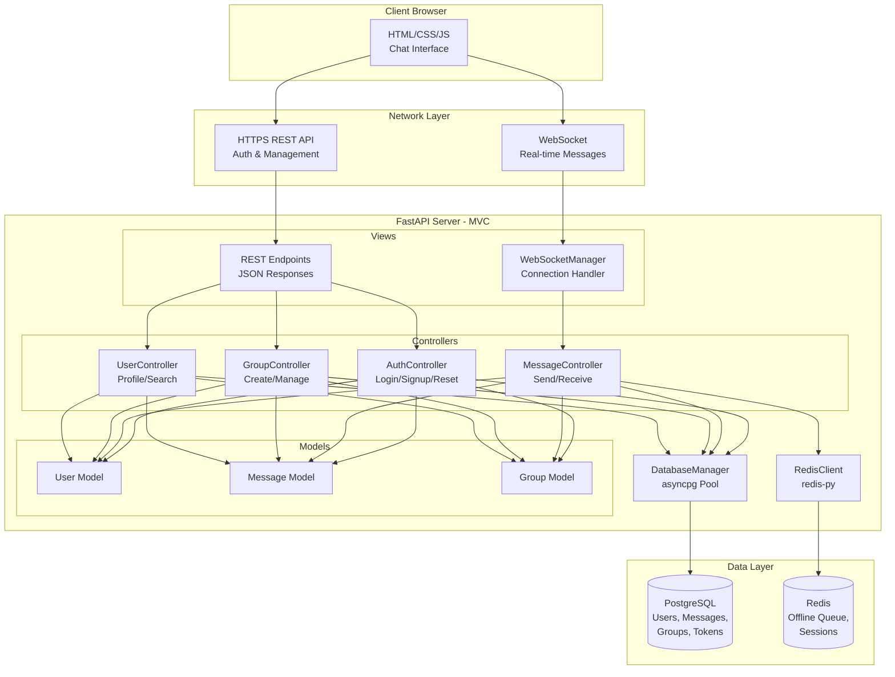
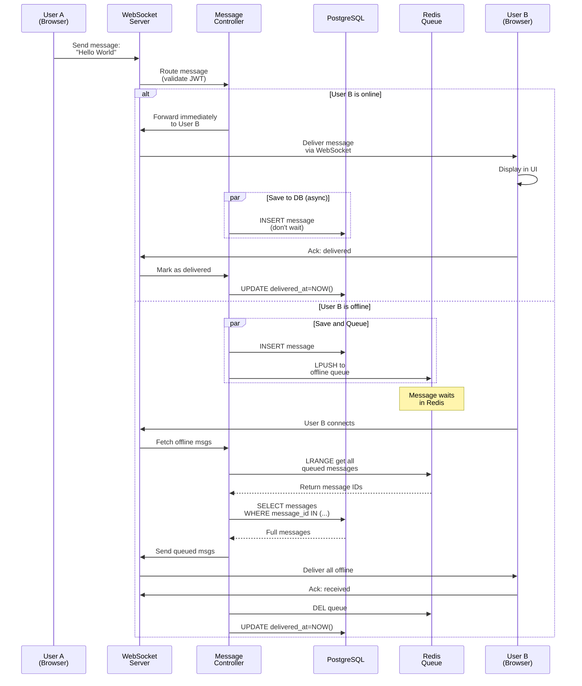
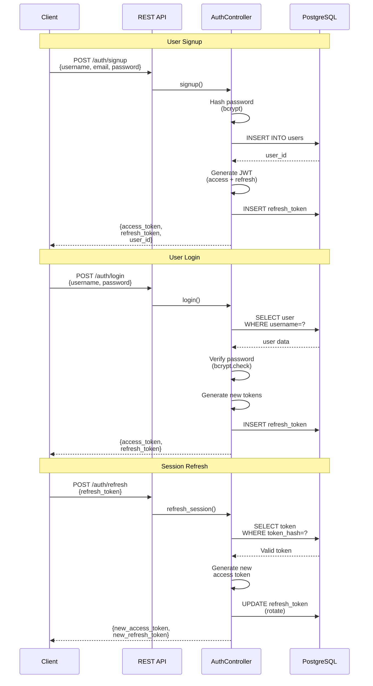
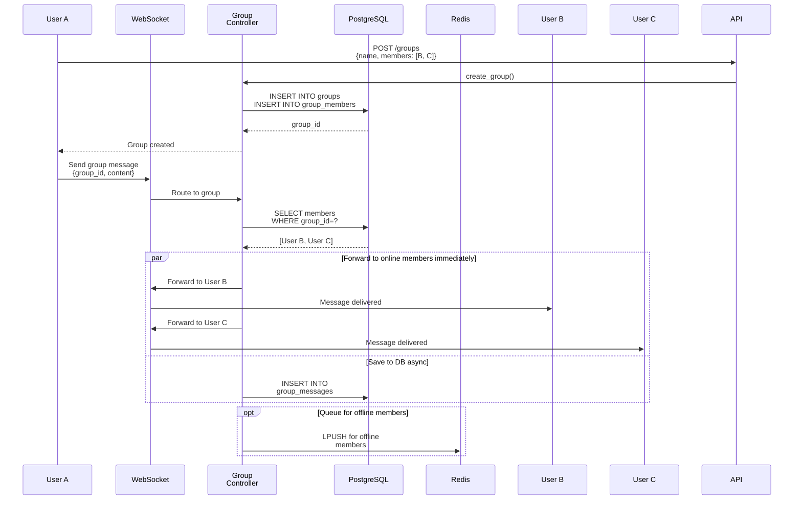
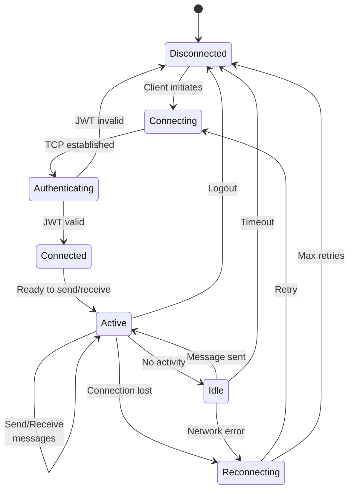
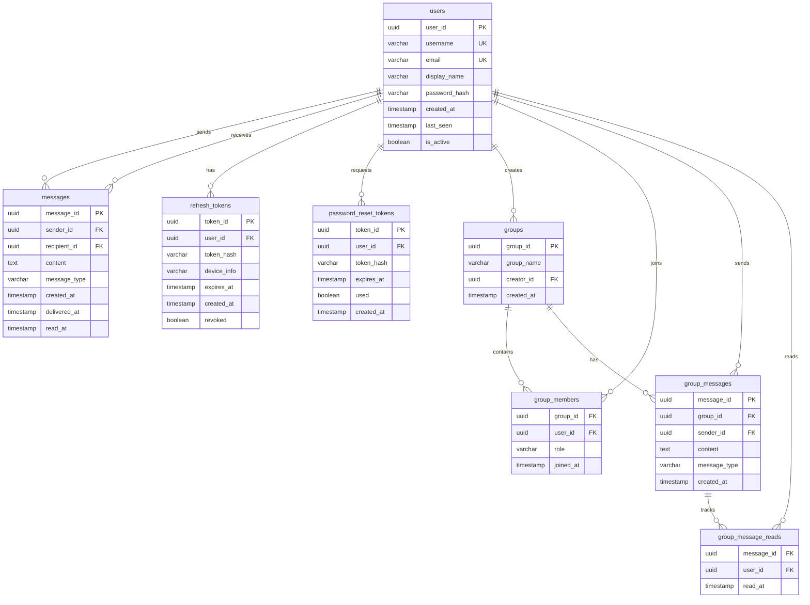

# Real-time Chat Server - Technical Solution Document

## 1. System Overview

A real-time chat server built with FastAPI enabling one-to-one and group messaging. All messages are stored in PostgreSQL for historical access, with Redis used as a temporary queue for offline message delivery. A minimal frontend demonstrates functionality via WebSocket connections.

### Core Requirements
1. **Complete Authentication System** - Signup, login, logout, forgot/reset password, session check, session refresh
2. **One-to-One Chat** - Direct messaging between two users
3. **Group Chat** - Multi-user conversations
4. **Real-time Delivery** - WebSocket-based instant messaging
5. **Persistent Storage** - All messages stored in PostgreSQL database
6. **Offline Message Queue** - Redis queue for offline users

### Technology Stack
- **Backend**: FastAPI (Python 3.12+), PostgreSQL 16+, Redis 7+
- **Database Driver**: asyncpg (PostgreSQL), redis-py
- **Authentication**: PyJWT, bcrypt
- **Serialization**: orjson
- **Real-time**: WebSockets
- **Frontend**: HTML/CSS/Vanilla JavaScript (minimal demo)

---

## 2. System Architecture

### 2.1 High-Level Architecture



### 2.2 Message Flow (One-to-One)



### 2.3 Authentication Flow



### 2.4 Group Message Flow



### 2.5 WebSocket Connection States



---

## 3. Database Design

### 3.1 Entity Relationship Diagram



### 3.2 PostgreSQL Schema

```sql
CREATE TABLE users (
    user_id UUID PRIMARY KEY DEFAULT gen_random_uuid(),
    username VARCHAR(50) UNIQUE NOT NULL,
    email VARCHAR(255) UNIQUE NOT NULL,
    display_name VARCHAR(100),
    password_hash VARCHAR(255) NOT NULL,
    created_at TIMESTAMP DEFAULT CURRENT_TIMESTAMP,
    last_seen TIMESTAMP,
    is_active BOOLEAN DEFAULT true
);
CREATE INDEX idx_users_username ON users(username);
CREATE INDEX idx_users_email ON users(email);

CREATE TABLE refresh_tokens (
    token_id UUID PRIMARY KEY DEFAULT gen_random_uuid(),
    user_id UUID REFERENCES users(user_id) ON DELETE CASCADE,
    token_hash VARCHAR(255) NOT NULL,
    device_info VARCHAR(255),
    expires_at TIMESTAMP NOT NULL,
    created_at TIMESTAMP DEFAULT CURRENT_TIMESTAMP,
    revoked BOOLEAN DEFAULT false
);
CREATE INDEX idx_refresh_tokens_user ON refresh_tokens(user_id);
CREATE INDEX idx_refresh_tokens_hash ON refresh_tokens(token_hash);

CREATE TABLE password_reset_tokens (
    token_id UUID PRIMARY KEY DEFAULT gen_random_uuid(),
    user_id UUID REFERENCES users(user_id) ON DELETE CASCADE,
    token_hash VARCHAR(255) NOT NULL,
    expires_at TIMESTAMP NOT NULL,
    used BOOLEAN DEFAULT false,
    created_at TIMESTAMP DEFAULT CURRENT_TIMESTAMP
);
CREATE INDEX idx_password_reset_user ON password_reset_tokens(user_id);

CREATE TABLE messages (
    message_id UUID PRIMARY KEY DEFAULT gen_random_uuid(),
    sender_id UUID REFERENCES users(user_id) ON DELETE CASCADE,
    recipient_id UUID REFERENCES users(user_id) ON DELETE CASCADE,
    content TEXT NOT NULL,
    message_type VARCHAR(20) DEFAULT 'text',
    created_at TIMESTAMP DEFAULT CURRENT_TIMESTAMP,
    delivered_at TIMESTAMP,
    read_at TIMESTAMP
);
CREATE INDEX idx_messages_recipient ON messages(recipient_id, created_at DESC);
CREATE INDEX idx_messages_sender ON messages(sender_id, created_at DESC);
CREATE INDEX idx_messages_conversation ON messages(
    LEAST(sender_id, recipient_id),
    GREATEST(sender_id, recipient_id),
    created_at DESC
);

CREATE TABLE groups (
    group_id UUID PRIMARY KEY DEFAULT gen_random_uuid(),
    group_name VARCHAR(100) NOT NULL,
    creator_id UUID REFERENCES users(user_id) ON DELETE SET NULL,
    created_at TIMESTAMP DEFAULT CURRENT_TIMESTAMP
);

CREATE TABLE group_members (
    group_id UUID REFERENCES groups(group_id) ON DELETE CASCADE,
    user_id UUID REFERENCES users(user_id) ON DELETE CASCADE,
    role VARCHAR(20) DEFAULT 'member',
    joined_at TIMESTAMP DEFAULT CURRENT_TIMESTAMP,
    PRIMARY KEY (group_id, user_id)
);
CREATE INDEX idx_group_members_user ON group_members(user_id);

CREATE TABLE group_messages (
    message_id UUID PRIMARY KEY DEFAULT gen_random_uuid(),
    group_id UUID REFERENCES groups(group_id) ON DELETE CASCADE,
    sender_id UUID REFERENCES users(user_id) ON DELETE CASCADE,
    content TEXT NOT NULL,
    message_type VARCHAR(20) DEFAULT 'text',
    created_at TIMESTAMP DEFAULT CURRENT_TIMESTAMP
);
CREATE INDEX idx_group_messages_group ON group_messages(group_id, created_at DESC);
CREATE INDEX idx_group_messages_sender ON group_messages(sender_id);

CREATE TABLE group_message_reads (
    message_id UUID REFERENCES group_messages(message_id) ON DELETE CASCADE,
    user_id UUID REFERENCES users(user_id) ON DELETE CASCADE,
    read_at TIMESTAMP DEFAULT CURRENT_TIMESTAMP,
    PRIMARY KEY (message_id, user_id)
);
CREATE INDEX idx_group_message_reads_user ON group_message_reads(user_id);
```

### 3.3 Redis Data Structures

```
# Offline message queue (per user)
Key: offline_queue:{user_id}
Type: LIST
Value: JSON {message_id, type: "direct" | "group", timestamp}
TTL: 30 days

# Online user tracking
Key: online:{user_id}
Type: STRING
Value: "1"
TTL: 5 minutes (refreshed by heartbeat)

# WebSocket connection mapping
Key: ws_connections
Type: HASH
Field: user_id
Value: connection_id

# Session cache (optional)
Key: session:{user_id}
Type: STRING
Value: JSON {access_token_exp, refresh_token_id}
TTL: Match token expiry
```

**Why Redis for Offline Queue:**
- Fast LPUSH/RPOP operations (O(1))
- Automatic TTL for cleanup
- Reduces PostgreSQL load
- Messages still permanently stored in PostgreSQL
- Redis only holds message_id references for offline users

---

## 4. API Specification

### 4.1 Authentication Endpoints

| Method | Endpoint | Request Body | Response | Description |
|--------|----------|--------------|----------|-------------|
| POST | `/api/v1/auth/signup` | `{username, email, password}` | `{user_id, access_token, refresh_token}` | Register new user |
| POST | `/api/v1/auth/login` | `{username, password}` | `{user_id, access_token, refresh_token}` | Authenticate user |
| POST | `/api/v1/auth/logout` | `{refresh_token}` | `{success: true}` | Invalidate session |
| POST | `/api/v1/auth/forgot-password` | `{email}` | `{message}` | Send reset link |
| POST | `/api/v1/auth/reset-password` | `{token, new_password}` | `{success: true}` | Reset password |
| GET | `/api/v1/auth/session/check` | Header: `Authorization: Bearer {token}` | `{valid: true, user_id, expires_at}` | Validate token |
| POST | `/api/v1/auth/session/refresh` | `{refresh_token}` | `{access_token, refresh_token}` | Get new tokens |

### 4.2 User Endpoints

| Method | Endpoint | Response | Description |
|--------|----------|----------|-------------|
| GET | `/api/v1/users/{user_id}` | `{user_id, username, email, created_at}` | Get user profile |
| GET | `/api/v1/users/search?q={query}` | `{users: [{user_id, username}]}` | Search users |
| PUT | `/api/v1/users/me` | `{updated_user}` | Update own profile |

### 4.3 Message Endpoints

| Method | Endpoint | Request Body | Response | Description |
|--------|----------|--------------|----------|-------------|
| POST | `/api/v1/messages/send` | `{recipient_id, content}` | `{message_id, created_at}` | Send direct message (alternative to WebSocket) |
| GET | `/api/v1/messages/conversation/{user_id}` | Query: `limit, offset` | `{messages: [...]}` | Get conversation history |
| GET | `/api/v1/messages/unread` | - | `{messages: [...]}` | Get unread messages |

### 4.4 Group Endpoints

| Method | Endpoint | Request Body | Response | Description |
|--------|----------|--------------|----------|-------------|
| POST | `/api/v1/groups` | `{name, member_ids: [user_id]}` | `{group_id, name, members}` | Create group |
| GET | `/api/v1/groups/{group_id}` | - | `{group_id, name, members}` | Get group info |
| POST | `/api/v1/groups/{group_id}/members` | `{user_ids: [user_id]}` | `{success: true}` | Add members |
| DELETE | `/api/v1/groups/{group_id}/members/{user_id}` | - | `{success: true}` | Remove member |
| GET | `/api/v1/groups/{group_id}/messages` | Query: `limit, offset` | `{messages: [...]}` | Get group history |
| GET | `/api/v1/groups/my` | - | `{groups: [...]}` | Get user's groups |

### 4.5 WebSocket Protocol

**Connection URL:**
```
wss://api.example.com/ws?token={jwt_access_token}
```

**Client → Server Messages:**

```javascript
// Send direct message
{
  "type": "message.send",
  "recipient_id": "user-uuid",
  "content": "Hello World",
  "message_type": "text"
}

// Send group message
{
  "type": "message.group.send",
  "group_id": "group-uuid",
  "content": "Hello everyone",
  "message_type": "text"
}

// Mark message as read
{
  "type": "message.read",
  "message_id": "msg-uuid"
}

// Typing indicator
{
  "type": "typing",
  "recipient_id": "user-uuid",
  "is_typing": true
}

// Heartbeat
{
  "type": "ping"
}
```

**Server → Client Messages:**

```javascript
// New direct message
{
  "type": "message.new",
  "message_id": "uuid",
  "sender_id": "uuid",
  "content": "Hello",
  "message_type": "text",
  "created_at": "2026-01-08T10:30:00Z"
}

// New group message
{
  "type": "message.group.new",
  "message_id": "uuid",
  "group_id": "uuid",
  "sender_id": "uuid",
  "content": "Hello group",
  "created_at": "2026-01-08T10:30:00Z"
}

// Offline messages batch
{
  "type": "messages.offline",
  "messages": [
    {
      "message_id": "uuid",
      "type": "direct",
      "sender_id": "uuid",
      "content": "...",
      "created_at": "..."
    }
  ]
}

// Typing indicator
{
  "type": "typing",
  "user_id": "uuid",
  "is_typing": true
}

// Heartbeat response
{
  "type": "pong"
}

// Error
{
  "type": "error",
  "code": "INVALID_RECIPIENT",
  "message": "User not found"
}
```

---

## 5. Backend Architecture (FastAPI MVC + Services)

### 5.1 Project Structure

```
app/
├── main.py                          # FastAPI app entry point
│
├── models/                          # Data models (Pydantic request schemas)
│   ├── __init__.py
│   ├── base.py                      # BaseModelSchema, BaseCreateSchema
│   ├── user.py                      # User, UserCreate, UserResponse
│   └── messaging.py                 # Message, Group, GroupMember models
│
├── controllers/                     # API endpoints + route handlers
│   ├── __init__.py
│   ├── base.py                      # BaseController (ABC)
│   ├── auth.py                      # /auth/* endpoints + AuthController
│   ├── messaging.py                 # /messages/* and /groups/* endpoints
│   └── websocket.py                 # WebSocket endpoint (/ws)
│
├── services/                        # Business logic layer
│   ├── __init__.py
│   ├── base.py                      # BaseService (ABC)
│   ├── auth.py                      # AuthService (signup, login, etc.)
│   └── messaging.py                 # MessageService, GroupService, GroupMessageService
│
├── views/                           # Response schemas / DTOs
│   ├── __init__.py
│   ├── base.py                      # BaseView, ApiResponse, PaginatedResponse
│   ├── auth.py                      # TokenResponse, SessionResponse, etc.
│   ├── user.py                      # UserProfile
│   └── messaging.py                 # ClientMessage, ServerMessage schemas
│
├── websocket/                       # WebSocket handling
│   ├── __init__.py
│   ├── manager.py                   # WebSocketManager class
│   └── handler.py                   # WebSocketHandler class
│
├── cache/                           # Redis cache utilities
│   ├── __init__.py
│   ├── client.py                    # RedisClient wrapper
│   ├── keys.py                      # RedisKeys (key patterns & TTLs)
│   └── websockets.py                # WebSocketCacheService
│
├── database/
│   ├── __init__.py                  # Lifespan manager (db pool, redis, ws_manager)
│   ├── run_migrations.py            # Migration runner script
│   └── migrations/
│       ├── 001_create_users_table.py
│       ├── 002_create_refresh_tokens_table.py
│       ├── 003_create_messages_table.py
│       ├── 004_create_groups_table.py
│       ├── 005_create_group_members_table.py
│       ├── 006_create_group_messages_table.py
│       └── 007_create_group_message_reads_table.py
│
├── dependencies/
│   ├── __init__.py
│   ├── cache.py                     # get_redis_client dependency
│   └── database.py                  # acquire_db_connection dependency
│
├── utils/
│   ├── __init__.py
│   ├── config.py                    # Configuration (env vars, secrets)
│   ├── jwts.py                      # JWT encode/decode/verify
│   └── logs/                        # Logging utilities
│       ├── __init__.py
│       ├── errors.py                # ErrorLogger
│       ├── dependencies.py          # Logger dependencies
│       └── middleware.py            # LoggingMiddleware
│
└── tests/
    ├── test_auth.py
    ├── test_messages.py
    └── test_groups.py
```

### 5.2 Core Classes

**Base Classes:**

```python
class BaseService(ABC):
    """Abstract base for all services (business logic)"""
    def __init__(self, db: Connection, logger: ErrorLogger = None)
    @property db -> Connection
    @property logger -> ErrorLogger
    async def log_error(message: str, **kwargs)
    async def log_info(message: str, **kwargs)

class BaseController(ABC):
    """Abstract base for all controllers (API endpoints)"""
    def __init__(self, db: Connection, logger: ErrorLogger = None)
    @property db -> Connection
    @property logger -> ErrorLogger
    async def log_error(message: str, **kwargs)
    async def log_info(message: str, **kwargs)
```

**Services (Business Logic):**

```python
class AuthService(BaseService):
    """Authentication business logic"""
    async def signup(username: str, email: str, password: str, ...) -> dict
    async def login(username: str, password: str) -> dict
    async def logout(refresh_token: str) -> bool
    async def refresh(refresh_token: str) -> dict
    async def check_session(user_id: UUID) -> dict
    # Password hashing, token generation handled internally

class MessageService(BaseService):
    """Message handling business logic"""
    async def send_message(sender_id: str, recipient_id: str, content: str) -> Message
    async def get_conversation(user1_id: str, user2_id: str, limit: int) -> list[Message]
    async def queue_offline_message(user_id: str, message_id: str)
    async def get_offline_messages(user_id: str) -> list[Message]

class GroupService(BaseService):
    """Group management business logic"""
    async def create_group(creator_id: str, name: str, member_ids: list[str]) -> Group
    async def add_members(group_id: str, user_ids: list[str]) -> bool
    async def remove_member(group_id: str, user_id: str) -> bool
    async def send_group_message(group_id: str, sender_id: str, content: str) -> Message
```

**Controllers (API Endpoints + Route Handlers):**

```python
class AuthController(BaseController):
    """Auth endpoint handlers - delegates to AuthService"""
    def __init__(self, db, logger):
        self._auth_service = AuthService(db, logger)
    async def signup(...) -> dict  # Handles HTTP errors
    async def login(...) -> dict
    async def logout(...) -> dict
    async def refresh(...) -> dict
    async def check_session(...) -> dict

# FastAPI router with endpoints
router = APIRouter(prefix="/api/v1/auth")

@router.post("/signup")
async def signup(request: SignupRequest, db: Connection, logger: ErrorLogger):
    controller = AuthController(db, logger)
    return await controller.signup(...)
```

**WebSocket Manager:**

```python
class WebSocketManager:
    """Manages WebSocket connections"""
    async def connect(user_id: str, websocket: WebSocket)
    async def disconnect(user_id: str)
    async def send_message(user_id: str, message: dict)
    async def broadcast_to_group(group_id: str, message: dict, exclude_user: str = None)
    def is_online(user_id: str) -> bool
```

---

## 6. Data Flow Examples

### 6.1 Send Direct Message (Online Recipient)

1. User A types message in UI
2. Client sends via WebSocket: `{type: "message.send", recipient_id: "B", content: "Hi"}`
3. Server validates JWT from WebSocket connection
4. Server checks if User B is online (Redis lookup) → YES
5. **Server immediately forwards message to User B via WebSocket** (real-time delivery)
6. User B receives message, displays in UI instantly
7. **Server saves message to PostgreSQL asynchronously** (don't block on this)
8. User B sends read receipt
9. Server updates `delivered_at` and `read_at` in PostgreSQL

**Key Point:** Message delivered to recipient BEFORE database write completes - this is critical for real-time performance.

### 6.2 Send Direct Message (Offline Recipient)

1. User A sends message to User B
2. Server checks if User B is online → NOT online
3. **Server saves message to PostgreSQL** (since recipient offline, need persistence first)
4. Server adds message_id to Redis queue: `LPUSH offline_queue:B {message_id, type: "direct"}`
5. Server responds to User A: message sent
6. *Later* User B connects via WebSocket
7. Server detects connection, queries Redis: `LRANGE offline_queue:B 0 -1`
8. Server fetches full message details from PostgreSQL using message_ids
9. Server sends batch of offline messages to User B
10. User B acknowledges receipt
11. Server deletes Redis queue: `DEL offline_queue:B`
12. Server sets `delivered_at` timestamp in PostgreSQL
13. User B can now query full history from PostgreSQL

**Key Point:** For offline users, we save to DB first (need durability), then queue reference in Redis.

### 6.3 Group Message

1. User A sends message to Group X
2. Server queries group members from `group_members` table
3. **For online members: Immediately forward via WebSocket** (real-time)
4. **For offline members: Add to Redis offline queue**
5. **Save to PostgreSQL asynchronously** (`group_messages` table)
6. Online members receive and display instantly
7. Offline members get queued messages when they reconnect

**Key Point:** Online users get instant delivery, offline users get queued, DB save happens asynchronously.

### 6.4 Authentication Flow

1. User submits signup form
2. Server validates input (username unique, email format, password strength)
3. Server hashes password with bcrypt (cost factor 12)
4. Server inserts user into `users` table
5. Server generates JWT access token (15 min expiry) and refresh token (7 days)
6. Server stores refresh token hash in `refresh_tokens` table
7. Server returns both tokens to client
8. Client stores tokens (localStorage or sessionStorage)
9. Client includes access token in Authorization header for API calls
10. Client includes token in WebSocket connection URL

---

## 7. Security Considerations

### 7.1 Authentication Security

- **Password Hashing**: bcrypt with cost factor 12
- **JWT Tokens**: 
  - Access token: 15 minutes expiry
  - Refresh token: 7 days, stored as hash in database
  - Token rotation on refresh
- **Rate Limiting**: 5 login attempts per 15 minutes per IP
- **Password Requirements**: Minimum 8 characters, at least one number and special char

### 7.2 WebSocket Security

- JWT validation on connection establishment
- Connection terminated on invalid token
- Rate limiting: Max 100 messages per minute per user
- Input validation on all message content

### 7.3 Input Validation

- SQL injection prevention: All queries parameterized
- XSS prevention: Content sanitized before storage
- Maximum message length: 10,000 characters
- Username/email format validation

### 7.4 Database Security

- Connection pooling with min/max limits
- Read-only user for query operations (if needed)
- Regular backups scheduled
- Sensitive data (passwords) never logged

---

## 8. Scalability & Performance

### 8.1 Database Optimization

- **Indexes**: Strategic indexes on frequently queried columns
- **Connection Pooling**: asyncpg pool (min=10, max=100)
- **Query Optimization**: Use EXPLAIN ANALYZE for slow queries
- **Pagination**: Limit/offset on message history queries

### 8.2 Redis Usage

- **Offline Queue**: Fast LPUSH/RPOP, auto-expiry after 30 days
- **Online Status**: Track in Redis with 5-minute TTL (refreshed by heartbeat)
- **Connection Mapping**: user_id → websocket_id in Redis hash
- **Memory Limit**: Configure maxmemory and eviction policy

### 8.3 WebSocket Scaling

- **Connection Registry**: In-memory map per server instance
- **Horizontal Scaling**: Use Redis Pub/Sub for cross-server messaging
- **Load Balancing**: Sticky sessions OR Redis pub/sub for any-server routing
- **Health Checks/Keep alive**: Ping/pong every 30 seconds

### 8.4 Message Delivery

- **Batch Offline Delivery**: Send up to 100 messages at once
- **Pagination**: Message history paginated (50 messages per page)
- **Cleanup**: Cron job to delete old messages

---

## 9. Frontend (Minimal Demo)

### 9.1 File Structure

```
frontend/
├── index.html          # Login/Signup page
├── chat.html           # Main chat interface
├── style.css           # Basic styling
└── app.js              # WebSocket + API calls
```

### 9.2 Features

**index.html:**
- Login form (username, password)
- Signup form (username, email, password)
- Forgot password link

**chat.html:**
- User list (search and select)
- Conversation area (messages displayed)
- Message input box
- Send button
- Group creation button
- Logout button

**app.js:**
- Fetch API for REST endpoints
- WebSocket connection management
- Message send/receive handling
- Auto-reconnect logic
- Token refresh logic